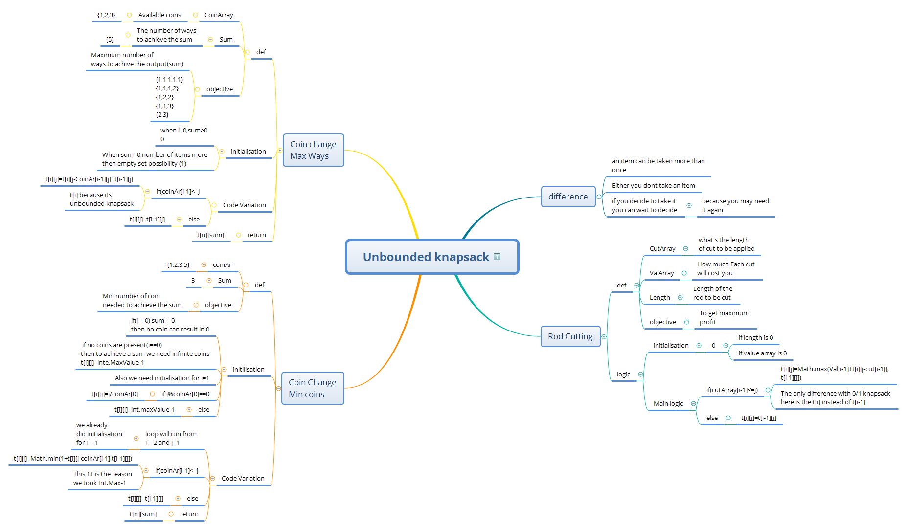

# Unbounded Knapsack Problem notes ( Dynamic programming)

Based on notes prepared from Dynamic Programming playlist from Aditya Verma

[click this if you prefer HTML way](https://htmlpreview.github.io/?https://raw.githubusercontent.com/gauravkhuraana/Testing/main/Test%20Data/Test%20Data.html)

